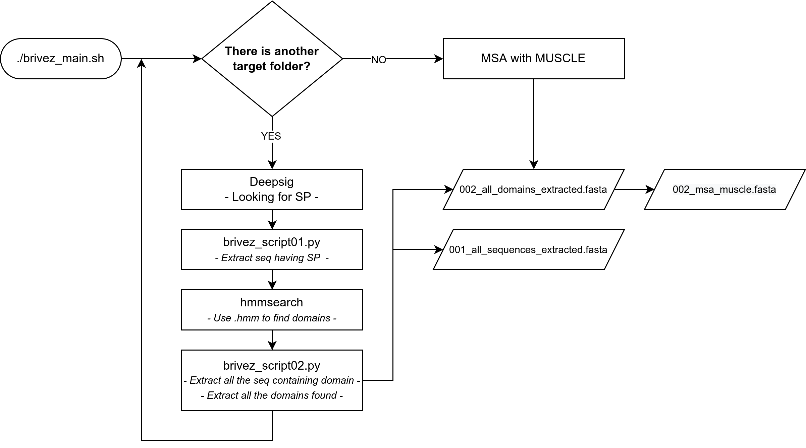

Brivez is a bioinformatic tool thought as Quality of Life's improvement, providing high quantity of data in a snap, 
giving you a quick view on what you could find inside your transcriptome/sequences' list.

Installation requirments aside, you will need two file:
  - `domain_profile.hmm` of your interest (or an entire database)
  Put it inside the 00_hmm_profile_target folder
  - `Danio_rerio_sequence/s.fasta`
  Put it inside the 01_Danio_rerio folder

[1] Read the documentation. [2] The first time follow the checklist. [3] Run ./brivez_main.sh. [4] Done!

Every sequence is analyzed by `Deepsig` which is looking for Signal Peptide; 
the positive matches undergo to `hmmsearch` analysis, creating a table with inside the domain described by the profile.hmm used. In the end every domain found in this way is extracted and saved inside the final output file.fasta.

- **warning**: the tool strictly check if there are the domains described inside ~.hmm.  
The sequence SP+DomainTarget+DomainNotDescribedByHmmFile is a positive match (but only the first domain is going to be extracted).have been extracted inside a ~.fasta file.

- **warning**: the tool strictly check if there are the domains described inside ~.hmm.  
Both SP+DomainTarget and SP+DomainTarget+AntherKindOfDomain are a positive match.

**At the moment this program run exclusively on Linux (tested on Debian 11 and Ubuntu 22.04).**  
See [Future updates](#future-updates) for Mac and Windows.

All the software used are OpenSource. 

<table>
<th>Brivez runs locally, ergo offline</th>
<tr><td>

- **Multi-core CPU** is suggested
- **Total space used**: ~3.5 GB
- **SSD** is suggested
</td></tr>
</table>

# Index #
- [Flowchart](#flowchart) 
- [Software requirements](#software-requirements) 
- [Quickly set up](#quickly-set-up) 
- [First run and checklist](#first-run-and-checklist) 
- [Avoid the following](#avoid-the-following) 
- [HMMER tool in details](#HMMER-tool-in-details) 
- [Future updates](#future-updates) 

# Flowchart

# Software requirements
Long list short:
- Conda (minimum ~3 GB)
- Environment inside Conda with:
  - Deepsig (~50 MB)
  - Pandas (~15 MB)
  - Bio-conda (channel)
  - fnmatch (samtools ~1 MB)
  - MUSCLE (~300 KB)
- HMMER3 v3.3.2 (~20 MB)
- Brivez (~1 MB)

# Quickly set up

**01 - Quick install for [Conda](https://docs.conda.io/en/latest/)** (following the online doc is suggested):
   1) Download the installer at this [link](https://docs.conda.io/projects/conda/en/latest/user-guide/install/linux.html)
   2) Verify your installer hashes
   3) In the terminal run `bash Anaconda-latest-Linux-x86_64.sh`. 
   Now in your terminal you will see something like `(base) user@host:~$`: the `base` indicates the name of the active environment.  It's possible to create an environment _ad hoc_ running in the terminal: `conda create - n name_of_the_environment`. To see all the env use `conda env list`.
   4) Choose the environment with `conda activate name_of_the_environment` (`conda deactivate [...]` to close the active environment).

**---- By this point be sure having activated the right environment! ----**

**02 - Install in Conda some stuff:** 
   1) conda config --add channels bioconda
   2) conda install -c bioconda samtools
   3) conda install -c conda-forge dpath
   4) conda install pandas

**03 - Install the predictor of signal peptides, [**DeepSig**](https://github.com/BolognaBiocomp/deepsig)** 
   1) Just as described on its site, use  `conda install -c bioconda deepsig`

**04 - Install [HMMER3](http://hmmer.org/)** 
   1) Just as described on its site, use `sudo apt-get install hmmer` (v3.3.2 both on Ubuntu 22.04 and Debian 11).
  Otherwise is installable following the [official documentation](http://hmmer.org/documentation.html)

**05 - Install the multiple alignments of biological sequences [**MUSCLE**](https://github.com/rcedgar/muscle)** 
   1) Just as described [here](https://anaconda.org/bioconda/muscle), use  `conda install -c bioconda muscle`

**06 - Download Brivez** 
   1) Download the Brivez folder with 
`git clone https://github.com/furacca/bravez`
or whatever way you prefer

# First run and checklist

BEFORE ever thinking of running Brivez you MUST:  
**01 - GIVE PERMISSIONS TO SCRIPTS** 
- Inside your folder type `chmod +x ./00_script/TOOL_chmod_the_scripts.sh && ./00_script/TOOL_chmod_the_scripts.sh`.  
Now all the script files can see their job done.

**02 - ONE FOLDER PER ONE SEQUENCE'S LIST / TRANSCRIPTOME** 
1) Create a folder (if you have multiple transcriptome, using the organism's name could be a great thing)
2) Put your sequence's list inside the folder, **using the .fasta format** (no .fas, .fa, ..)
3) Keep the ratio **1 transcriptome : 1 folder**

**03 - OPTIONAL - REMOVE ALL THE ASTERISKS FROM FASTA FILE** 
- Consider to remove all the asterisks from all your fasta file, with: 
`./00_script/TOOL_remove_asterisk_From_fasta_file` 
This will overwrite the original file.

**03 - ONE HMM FILE INSIDE 00_hmm_profile_target** 
- Download from [Pfam](https://pfam.xfam.org/) the hmm file that you are going to use (maybe can be helpfully follow [the following guide](https://github.com/furacca/brivez/blob/main/README_Pfam_database.md)).

**04 - OPTIONAL - CHECKLIST** 
- Follow this [checklist](https://github.com/furacca/brivez/blob/main/README_checklist.md) to be sure that everything's ok.

**05 - RUN BRIVEZ** 
- In the root of the Brivez folder type in the terminal: 
`./brivez_main.sh`

**06 - CLEAN UP THE WORKSPACE** 
- Delete every output folder created and the log file with 
`./wipe_all.sh`

# Avoid the following
- **DO NOT CHANGE / RENAME / MOVE ANY FOLDER / FILE**, unless is something that you have added!

# HMMER tool in details
Brivez run hmmsearch with the following arguments: 
`hmmsearch --domtblout table.output -E 1e-5 --domE 1e-5 --cpu 2 hmmfile target.fastsa` 

This **can be edited** at **line 95** inside `brivez_man.sh`. 

- `-E 1e-5`
  Report target sequences with an E-value of <= X. The default is 10.0 ([read p. 104](http://eddylab.org/software/hmmer/Userguide.pdf)).
- `--domE 1e-5`
  For target sequences that have already satisfied the per-profile reporting threshold, report individual domains with a conditional E-value of <= X. The default is 10.0 ([read p. 104](http://eddylab.org/software/hmmer/Userguide.pdf)).
- `--cpu 2`
  Set the number of parallel worker threads to N. On multicore machines, the defaults is two. Can be use also --mpi in alternative ([read p. 107](http://eddylab.org/software/hmmer/Userguide.pdf)).

From the table.output are extracted two kind of coordinates:
- `ali coord`
  The start of the [MEA](#useful-things-to-know) alignment of this domain with respect to the sequence ([read p. 72](http://eddylab.org/software/hmmer/Userguide.pdf))
- `env coord`
  The start and the end of the domain envelope on the sequence. ([read p. 72](http://eddylab.org/software/hmmer/Userguide.pdf))

**By default, Brivez use the env coord**, but it's possible to **change it** on line 43 in ./00_script/brivez_script02.py:
- change df_selected = df[["target_name", "query_name", "accession1", "START_envelope", "END_envelope"]]  
- with df_selected = df[["target_name", "query_name", "accession1", "START_ali", "END_ali"]]
 

#### Useful things to know:
- `hmmpress` is useful only if used with `hmmscan` ([read p. 97](http://eddylab.org/software/hmmer/Userguide.pdf))
- `MEA` Maximum Expected Accuracy
- `envelope` When HMMER identifies domains, it identifies what it calls an envelope bounding where the domain’s alignment most probably lies. The envelope is almost always a little wider than what HMMER chooses to show as a
reasonably confident alignment.

# Future updates

**TOP PRIORITY**
- Reorganizing commenting for all the code
- Output file ready to be elaborated with Muscle/TCoffee and MrBayes (.nexus)

**MEDIUM PRIORITY**
- Extracted list of all SP (008_*.fa maybe?)
- Create checkpoint to have multiple feedbacks while the program is ongoing (and create a REPORT!)

**LOW PRIORITY**
- Check some solution for Mac and Windows 10 - 11 (with Windows subsystem for Linux)
- Choose multiple domains (multiple .hmm file, auto-reading the 00_hhm~~ folder content)
- Choose the sequences with SP+DomainOfInterest, avoiding SP+DomainOfInterest+AnotherDomain (needing full Pfam database)
