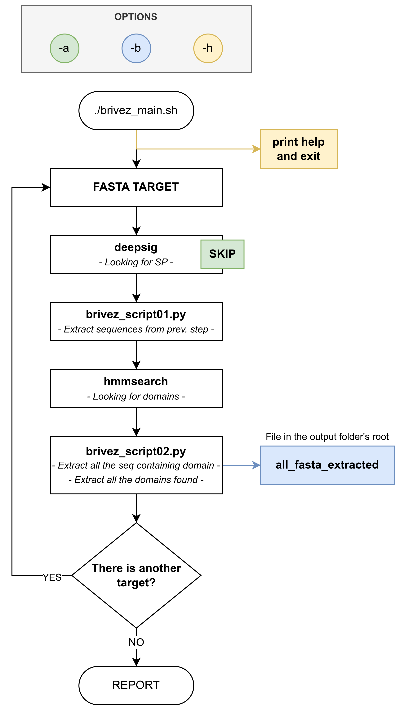

Brivez is a bioinformatic tool thought as Quality of Life's improvement, providing high quantity of data in a snap, 
giving you a quick view on what you could find inside your transcriptome/sequences' list.

Installation requirements aside, you will need two files:
  - `domain_profile.hmm`
  It goes inside --> 01_hmm_profiles folder
  - `sequence(s).fasta`
  It goes inside --> 02_fasta_target

**Suggested way to proceed:**
1) Read the documentation
2) The first time follow the checklist
3) Run ./brivez_main.sh

**At the moment this program runs exclusively on Linux (tested on Debian 11 and Ubuntu 22.04).**  

See [future updates](#future-updates) for Mac and Windows.

All the software used are **OpenSource**. 

<table>
<th>Brivez runs locally</th>
<tr><td>

- Multi-core CPU is suggested
- Total space used: ~3.5 GB
- SSD is strongly suggested
- 16 GB RAM is suggested

</td></tr>
</table>

# Index #
- [Workflow](#workflow) 
- [Software requirements](#software-requirements) 
- [Quickly set up](#quickly-set-up) 
- [First run](#first-run) 
- [Read results](#read-results) 
- [Useful link](#useful-link) 
- [Future updates](#future-updates) 

# Workflow
Brivez analyses every fasta file insiede `02_fasta_target`. 
Every single run follow these workflow:
- Runs Deepsig looking for Signal Peptide (can be disabled with `-a`)
- Uses the sequences found in the previously step
- Searches for domains using the hmm file inside `01_hmm_profiles`
  - If Brivez founds more than one hmm file, it asks which one choose
- Generates multiple output files for each fasta target
  - A file with all the domain extraced can be genereted with `-b` option

###### Flowchart realized with to [draw.io](https://github.com/jgraph/drawio)_

 

# Software requirements

- Conda (minimum ~3 GB)
- Environment inside Conda with:
  - Deepsig (~50 MB) **--> needs PYTHON 3.8 !**
  - Pandas (~15 MB)
  - Bio-conda (channel)
  - fnmatch (samtools ~1 MB)
- HMMER3 v3.3.2 (~20 MB)
- Brivez (~1 MB)

# Quickly set up

**01 - Quick install for [Conda](https://docs.conda.io/en/latest/)** (following the online doc is suggested):
   1) Download the installer at this [link](https://docs.conda.io/projects/conda/en/latest/user-guide/install/linux.html)
   2) Verify your installer hashes
   3) In the terminal run  
   `bash Anaconda-latest-Linux-x86_64.sh`  
   Create an environment _ad hoc_ 
   `conda create -n bioinfo-brivez python=3.8` 
   To see all the env created 
   `conda env list`
   4) Choose the environment with  
   `conda activate bioinfo-brivez` 
   to close it use 
   `conda deactivate bioinfo-brivez`

**---- By this point be sure to have activated the right environment! ----**

**02 - Install in Conda some stuff:** 
   - `conda config --add channels bioconda` 
   - `conda install -c bioconda samtools` 
   - `conda install -c conda-forge dpath` 
   - `conda install pandas`

**03 - Install the predictor of signal peptides, [**DeepSig**](https://github.com/BolognaBiocomp/deepsig)** 
   - Just as described on its site, use  `conda install -c bioconda deepsig`

**04 - Install [HMMER3](http://hmmer.org/)** 
   - Just as described on its site, use 
   `sudo apt-get install hmmer` 
   (v3.3.2 both on Ubuntu 22.04 and Debian 11)
  Otherwise is installable following the [official documentation](http://hmmer.org/documentation.html)

**05 - Download Brivez** 
   - Download the Brivez folder with 
`git clone https://github.com/furacca/brivez` 
or whatever way you prefer

# First run

1) `01_hmm_profiles`
   - contains your hmm files (check [hmm - Pfam download](00_documentation/README_Pfam_database.md))

2) `02_fasta_target` 
   - contains your fasta files
   - the only accepted format is fasta (no fas, fa, ...)

3) Be sure to have the right environment activated 
   - `conda activate therightenvironment`

4) Run Brivez with 
`./brivez_main.sh`

# Read results
Inside the `03_results` you will have your output folder, all with the same structure:

- Research_number_XXX
   - fasta_target1 (directory)
      - multiples files
   - fasta targetX (directory)
      - multiples files
   - Report (file)

For every fasta target there will be one folder containings the following:
   - **01_deepsig-analysis.tsv**
      - Deepsig analysis; if `-a` is enabled, then is empty
   - **02_sequences_selected.fasta**
      - Sequences with SP by deepsig; if `-a` is enabled, all sequences are selected
   - **03_hmmsearch_output_table**
      - hmmsearch output
   - **04_hmmsearch_output_table_data_parsed**
      - hmmsearch output parsed in csv
   - **05_pandas_sequences_table.tsv**
      - pandas table with the list of all domains found
   - **06_sequences_which_have_domains.fasta**
      - list of sequences presenting domains found
   - **07_extracted_domains.fasta**
      - domains found extracted by the selected sequences
   - **08_extracted_domains.csv**
      - same as 07, but in csv format
   - **09_domains_found.csv**

**Important**
The **08_extracted_domains.csv** file can be easyly read in calc/excel selecting all the cells and clicking on Data -> Autofilters.

# Useful link
- [hmm - Pfam download](00_documentation/README_Pfam_database.md)  
Contains tutorials on:
   - How to download the full Pfam database
   - How to download a specific ~.hmm file from pfam
- [Hmmer cheatsheet](00_documentation/README_hmmer.md)

# Known problems
None (yet).

# Future updates

**TOP PRIORITY**
- None

**MEDIUM PRIORITY**
- Simpler way to user Brivez (Docker? Appimage?)
- List of the sequences with just one domain type (needing full Pfam database)

_**LOW PRIORITY**_
- Check some solution for Mac and Windows (Docker?)
- Extracted list of all SP
